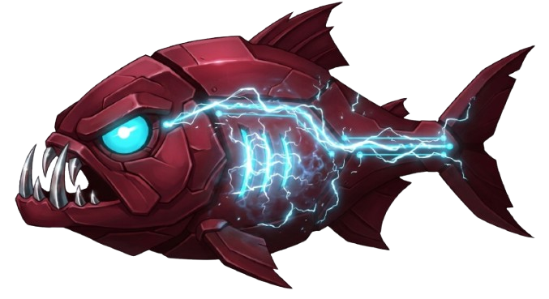

<!-- Repo links below use the slug `airtajal/ai-agents`. After renaming the repo to
     `piranha`, find-and-replace `airtajal/ai-agents` → `airtajal/piranha`. -->

<p align="center">
  
</p>

<h1 align="center">Piranha</h1>

<p align="center"><b>Throw a task in. Watch the swarm.</b></p>

<p align="center">
  A swarm of AI agents that strips your backlog to the bone — they <b>plan → build → QA</b> in
  isolated git worktrees, and <b>nothing lands in <code>main</code> without your click</b>.
</p>

<p align="center">
  
  
</p>

<p align="center">
  <a href="#-quick-start"><b>Quick start</b></a> ·
  <a href="./docs/SPEC.md">Spec</a> ·
  <a href="./ROADMAP.md">Roadmap</a> ·
  <a href="./SECURITY.md">Security</a>
</p>

<!-- HERO GIF — record a ~15s screen capture of a task flowing plan → build → qa → review → merge,
     drop it at docs/assets/demo.gif, then uncomment the line below. It's the single
     highest-ROI thing in this README — see ROADMAP.md.
<p align="center"></p>
-->
<p align="center"><i>▶ demo GIF goes here — the highest-ROI addition to this page. See <a href="./ROADMAP.md">ROADMAP</a>.</i></p>

---

## 🦈 Why Piranha

Most agentic coding tools hand you a **chat** or a **CLI**. Piranha hands you a **Kanban board of
autonomous agents** with a **hard human-review gate before any merge** and **per-agent worktree
isolation** — so you can turn many agents loose, unattended, and still never lose control of what
enters `main`.

| | **Piranha** | OpenHands | Aider |
| :-- | :--: | :--: | :--: |
| Visual Kanban board of live agents | ✅ | — | — |
| Human-approved merge gate | ✅ | — | — |
| Per-agent git worktree isolation | ✅ | — | — |
| Local / private code embeddings | ✅ | partial | — |
| Runs unattended (breaker, watchdog, resume) | ✅ | — | — |
| Self-hosted | ✅ | ✅ | ✅ |

### The bite — four things nobody else pairs

- 🩸 **Human-gated merge** — nothing touches `main` without your click. QA passes → the task parks in review → you preview the branch → you approve. The orchestrator is the *only* thing that merges.
- 🔒 **Local embeddings** — your code never leaves your machine. A per-project semantic index runs **on-device** (`@huggingface/transformers`); no cloud upload.
- 🧠 **Shared context memory** — agents remember instead of re-reading. An LRU context cache + your pins, **auto-synced to disk on every merge**, so each agent inherits a curated project context instead of cold-starting.
- 🐟 **Worktree isolation** — every agent works in its own git worktree. Parallel tasks never collide; one merge writer keeps the tree sane.

---

A Jira-like Kanban board that drives `claude` CLI agents through a **plan → build → qa → merge** pipeline in isolated git worktrees. You write tasks (or paste a chat message that's decomposed into tasks); an orchestrator dispatches headless Claude agents to work them, gates each merge behind a human review, and keeps the whole thing running unattended — surviving API outages, stalls, and restarts.

Everything is **project-scoped**: multiple projects, each with its own git repo/worktrees, GitHub token(s), code-embedding index, and tasks. A `default` project always exists.

## Architecture

Three processes run together (`pnpm run agents` starts all three):

| Process | What it is | Port |
| :-- | :-- | :-- |
| **Frontend** | Vite + React Kanban board (redirects `/` → `/tasks`) | **6951** |
| **db-server** | Raw-`http` API (`db/server.ts`) over SQLite (`node:sqlite`): tasks, git control, code search, projects, system status | **6952** |
| **Orchestrator** | The brain (`scripts/orchestrator.ts` → `agentic/`): routes tasks through stages, spawns/kills agents, enforces leases, watchdog, circuit breaker | — |

- **agentic-core** (`agentic/`) is the reusable runtime engine the orchestrator wraps: stage routing, resource gate, retry/dead-letter, heartbeat, orphan cleanup. It's dependency-free except `node:*` builtins.
- **Code index**: a per-project code-embedding index built with `@huggingface/transformers` over the project's repo, queried via `POST /search` for semantic code retrieval.
- Databases (`tasks.db`, `logs.db`, and per-project code index files like `local.db` / `index-<project>.db`) are created on first boot under `db/`.

## 🚀 Quick start

### One command (Docker) — recommended

Only prerequisite: **Docker** and an **Anthropic API key**. Everything else (Node 22, pnpm, the `claude` CLI, git) is baked into the image.

```bash
ANTHROPIC_API_KEY=sk-ant-... docker compose up
```

Open **http://localhost:6951**. That's it — all three processes boot together.

> Ports are published to `127.0.0.1` only, so the unauthenticated API isn't exposed to your LAN. To have agents work on **your** repo instead of the demo repo, uncomment the `volumes:` block in [`docker-compose.yml`](./docker-compose.yml) and add a project in the UI pointing at the mounted path. (Container state is ephemeral — great for a test drive; run from source for persistent boards.)

### From source

Requirements: **Node ≥ 22** (uses the built-in `node:sqlite`), **pnpm**, and the `claude` CLI on your PATH (set `CLAUDE_BIN` to override).

```bash
pnpm install
cp .env.example .env       # edit VITE_API_BASE for a VPS; defaults are fine locally
pnpm run agents            # frontend + db-server + orchestrator together
```

Open **http://localhost:6951** → it redirects to `/tasks`.

Run pieces separately if you prefer: `pnpm run dev` (frontend), `pnpm run db:server`, `pnpm run db:orchestrator`.

## The pipeline & isolation

Tasks flow **plan → build → qa → merge**, with a **human review gate** before merge: when QA passes, the task parks in review, you build a live preview of the branch, and only your approval advances it to merge. The orchestrator is the single writer — only it merges.

**Non-git-host behavior:** if the host repo is not `git init`'d, `default`-project tasks run **in place** with no worktree isolation and no merge. Projects that point at a **cloned git repo** get the full worktree-isolated pipeline. Run `git init` on the host, or add a project pointing at a git repo, to enable isolation for default-project work.

## Features

### Projects
A project tab bar (with `+`) across the top. Each project has its own repo path, GitHub token(s), code index, and task board. Create / rename / delete projects; `default` can't be deleted.

### Git control (Git panel)
Per-project git management, all backed by the db-server's `/git/*` routes:
- **Multiple labeled PATs** with a scope (`readonly` for agents, `readwrite` for your own pushes), tokens masked on read and never echoed back.
- **Per-agent token assignment** — choose which PAT each agent role authenticates git with.
- **clone / commit / create-branch / push**, a **worktree browser** (which agent did which task, its branch, whether it's merged), and **commit history** (`log` + per-commit `show`).

### Code index
`@huggingface/transformers` embeddings over the project repo. Build/update from the CLI (`pnpm run db:build` / `db:update` / `db:ensure`) or from the UI (build / heal / **retarget** to a cloned repo). The index auto-heals: on corruption the db-server rebuilds it and pauses `/search` until it's ready.

### Context memory
Per-project working memory — the files agents currently hold in context. Modeled as a cache: agent-added files are LRU entries (evicted by staleness/size), your files are **pins** (never auto-evicted). It **reconciles against disk on every merge** (files deleted/renamed by the merge are dropped), plus a manual **Sweep** to age out stale entries and enforce the token budget.

### Task lifecycle controls
Per task: **start / pause / resume / stop** (stop kills any live agent and parks the task). Globally: **pause / start** the orchestrator — paused keeps it alive (heartbeat + watchdog still enforce stops, stalls, and lease reclaim) but stops handing out new work.

### Chat intake
Paste one natural-language message → `POST /intake` runs it through `claude -p` to decompose it into concrete tasks (with GIVEN/WHEN/THEN scenarios and a definition of done) that land on the board ready to run.

### Always-on status widget
A bottom-right widget (fed by `GET /system-status`) shows a human-readable status line, an up/down heartbeat, per-project task counts, and a recent-events feed.

### Resilience
Built to run unattended:
- **Circuit breaker** — on repeated network failures it probes `api.anthropic.com`, pauses dispatch, and auto-resumes when the API is reachable.
- **Watchdog** — stall detection (no output), hard runtime cap (looping agents), and lease reclaim for dead agents.
- **Restart-resume** — orphaned in-flight tasks are reconciled on boot and re-dispatched cleanly.
- **SQLite self-heal** — periodic integrity checks; the durable board (`tasks.db` / `logs.db`) is never auto-rebuilt (it pauses affected requests and alerts instead), while the derived code index is auto-rebuilt on corruption.

## Key scripts

| Script | Does |
| :-- | :-- |
| `pnpm run agents` | Frontend + db-server + orchestrator together |
| `pnpm run dev` | Frontend only (Vite, :6951) |
| `pnpm run db:server` | db-server only (:6952) |
| `pnpm run db:orchestrator` | Orchestrator only |
| `pnpm run db:build` / `db:update` / `db:ensure` | Build / update / ensure the code index |
| `pnpm test` | Run the test suite (vitest) |
| `npx tsx scripts/repair-db.ts` | Non-destructive SQLite repair (run with the pipeline stopped) |

## Environment

Config lives in `.env` (see `.env.example`):

| Var | Purpose |
| :-- | :-- |
| `VITE_API_BASE` | Frontend → db-server base URL (default `http://127.0.0.1:6952`; set to the public host on a VPS) |
| `DB_SERVER_PORT` | db-server port (default `6952`) |
| `DB_FILE` | Default code-index DB file (default `local.db`) |
| `CLAUDE_BIN` | Path to the `claude` CLI (default `claude`) |
| `CLAUDE_FLAGS` | Extra flags for the agent runner (e.g. `--dangerously-skip-permissions`) |
| `MODEL_ARCHITECT` / `MODEL_DEV` / `MODEL_QA` | Per-role model overrides |
| `HOST` | db-server bind address (default `127.0.0.1` / loopback). Set `0.0.0.0` only on a trusted, firewalled host — the API has no auth |
| `CORS_ALLOW_ORIGIN` | Extra allowed browser origin (a specific origin, or `*`). Localhost + same-host are always allowed |
| `PROJECTS_DIR` | Where cloned projects land (default: `<this-repo>/projects/`, git-ignored) |

## Security

This is a **local, single-user tool** that stores Git credentials on your machine and
runs an **unauthenticated** API. By default the db-server binds to **loopback only**
(`127.0.0.1`) and restricts CORS to localhost / same-host, so a web page you visit can't
reach it. Tokens are stored in local SQLite (git-ignored, never published) and masked in
API responses — but the API can still *use* them, so keep the port private.

Before exposing it on a LAN/VPS (`HOST=0.0.0.0`), or reporting a vulnerability, read
**[SECURITY.md](./SECURITY.md)**.

## Limitations & future scope

- **Anthropic-only (today).** Agents run through the `claude` CLI, so the model provider is currently Claude. This is a deliberate v0 constraint, not a design lock-in — the agent runner ([`agentic/engine/runner.ts`](./agentic/engine/runner.ts)) is the single seam that spawns the CLI.
  **Future scope:** a model-agnostic adapter behind that seam (OpenAI / Gemini / local Ollama), selectable per agent role — widening the tool to any team regardless of which model they pay for. Tracked in [ROADMAP.md](./ROADMAP.md).
- **Single-user / local.** No multi-user auth or shared cloud board yet. See [SECURITY.md](./SECURITY.md) before exposing it beyond loopback.
- **Self-hosted control plane.** You run it on your machine or your own VPS with your own API key. An optional hosted control plane (session-/seat-based, on a VPS) is on the roadmap.

See the full plan in **[ROADMAP.md](./ROADMAP.md)** — and the detailed product spec (releases,
backlog, working agreements) in **[docs/SPEC.md](./docs/SPEC.md)**.

## Run it headless (no UI)

The browser app is only a client of the API — the orchestrator and the db-server are fully
headless. Prefer the command line? Start the two backend services and drive everything over
HTTP: create a task, launch it, watch it move through the pipeline, review its diff, approve it.

Import the **[Postman collection](./docs/piranha.postman_collection.json)** — it has the whole
run loop wired up (create → trigger → watch → review the diff → approve), plus the workflow,
search, agents and git endpoints. Set the `baseUrl` and `project` collection variables, then
walk the folders top to bottom.

## License

Proprietary — © 2026 Airtajal, all rights reserved. See [LICENSE](./LICENSE).
Use requires a commercial license agreement; contact the owner for access.
